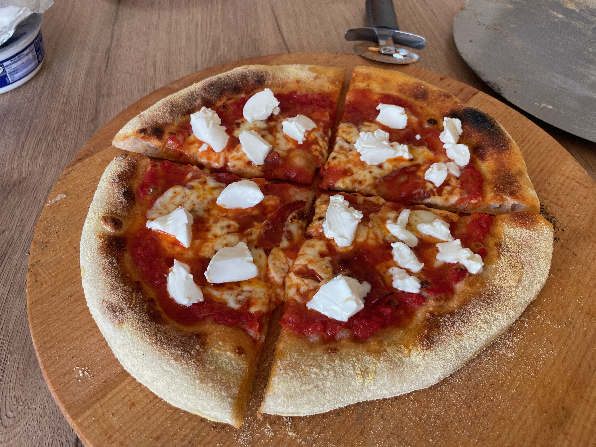
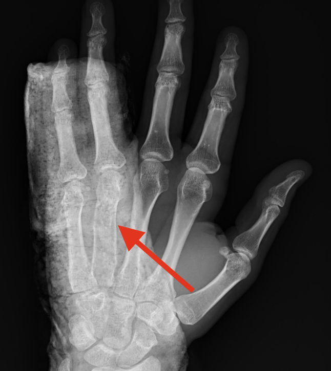
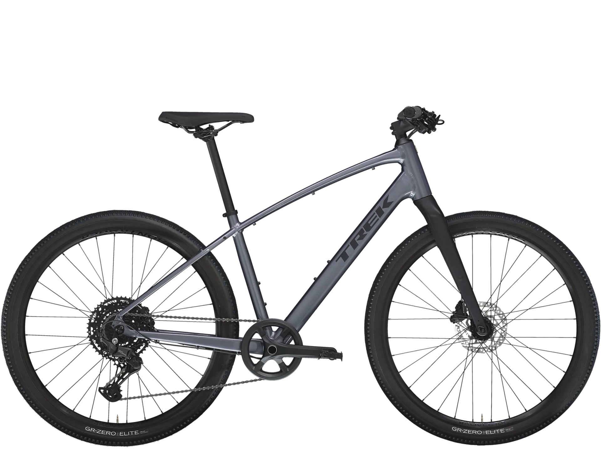

    <table>
        <tr>
            <td>Pieczenie pizzy</td>
            <td>
                Już chyba od pół roku bawię się w pieczenie pizzy. Na początku używałem zwykłego piekarnika. Jakiś miesiąc temu kupiłem na Aliexpress tani piecyk do pizzy. Nie jest dobry, ale czuć różnicę w porównaniu ze zwykłym piekarnikiem. Spód jest dopieczony a brzegi zarumienione.
                 
                <figure>
                    
                    <figcaption>Moja ostatnia pizza, mozarella, chorizo i mascarpone</figcaption>
                    </figure>
            </td>
        </tr>
        <tr>
            <td>Siatkówka</td>
            <td>
                Pierwszą styczność z siatkówką miałem w gimnazjum, gdy dostałem się do szkolnej drużyny. Po pójściu do szkoły średniej grałem coraz mniej. Pasja odrodziła się jakoś w 2021 roku. Od tamtej pory trenuję raz w tygodniu siatkówkę, a od roku 2025 2 razy. Czasami w weekendy grywam na turniejach. W ciągu ostatniego pół roku dwukrotnie złamałem dłoń podczas gry, jednak to mnie nie powstrzymało. Wróciłem do treningów, mam nadzieję, że to ju koniec kontuzji ;) 
                 
                <figure>
                    
                    <figcaption>Zdjęcie zrośniętej kości</figcaption>
                </figure>
            </td>
        </tr>
        <tr>
            <td>Rower</td>
            <td>
                Ostatnio zakupiłem rower. Aktualnie czekam, aż do mnie dojdzie. Mam nadzieję, że stanie się moją nową zajawką :P
                 
                <figure>
                    
                    <figcaption>Zdjęcie z neta, bo jeszcze go nie mam :/</figcaption>
                </figure>
            </td>
        </tr>
    </table>

